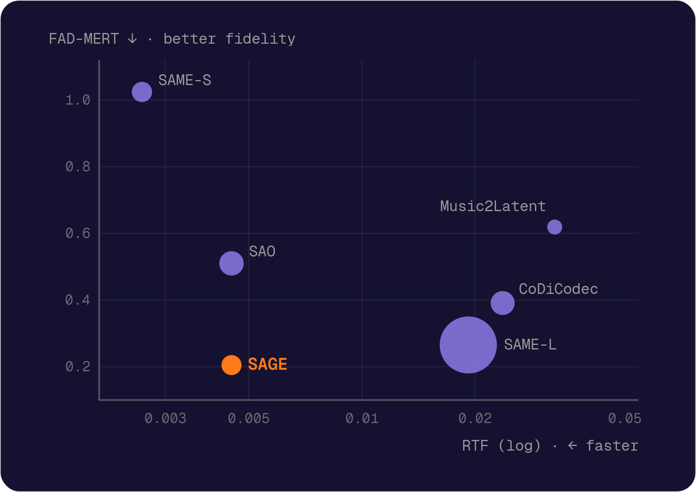

<h1 align="center">SAGE: Semantic Audio Generative Encoder</h1>

<p align="center">
Francesco Brigante<sup>1</sup> · Luca Cerovaz<sup>1,3</sup> · Davide Marincione<sup>1</sup> ·
Giorgio Strano<sup>1</sup> · Luca Zhou<sup>1</sup> · Emanuele Rodolà<sup>1,3</sup> ·
Michele Mancusi<sup>1,2</sup><br>
<sup>1</sup>Sapienza University of Rome · <sup>2</sup>Moises Systems · <sup>3</sup>Paradigma
</p>

<p align="center">
  <a href="https://arxiv.org/abs/2609.32755"></a>
  <a href="https://sage-music.pages.dev/"></a>
  <a href="https://huggingface.co/francescobrigante/SAGE"></a>
  <a href="LICENSE"></a>
</p>

<p align="center">
  <picture>
    <source media="(prefers-color-scheme: dark)" srcset="docs/assets/teaser_dark.png">
    <source media="(prefers-color-scheme: light)" srcset="docs/assets/teaser.png">
    
  </picture>
  <br><em>Distributional fidelity against inference cost on the MoisesDB mixtures; marker area is the parameter count.</em>
</p>

SAGE is a compact variational autoencoder for stereo music at 44.1 kHz. It encodes
audio into a 16-channel latent representation and decodes it back to a waveform.
The released model has 104.6M parameters, with 64× compression and approximately
86 latent frames per second (one frame per 512 input samples).

Its Swin Transformer V2 encoder and decoder operate on the STFT. During training,
semantic distillation from LAION-CLAP, a pretrained audio-text model, shapes the
latent representation.

- **Fast:** it runs at the inference cost of Stable Audio Open.
- **High fidelity:** its listening-test score matches SAME-L, an autoencoder 8× larger and 4×
  slower, and it surpasses both on objective perceptual and distributional reconstruction metrics.
- **Semantic latent:** it sets the state of the art on all nineteen probing tasks of latent
  semantics, in domain and out of domain.
- **Open data:** it is trained solely on publicly available music.

This repository includes pretrained-model inference, both training phases, and the
paper's evaluation code.

**What do you want to do?**

- Encode or reconstruct your own audio → [Quickstart](#quickstart)
- Train SAGE from scratch → [Training guide](docs/training.md)
- Reproduce the numbers of the paper → [Paper runs](docs/paper_runs.md)

## Quickstart

**1. Install.** You need Python 3.11 and [uv](https://docs.astral.sh/uv/).

```bash
git clone https://github.com/francescobrigante/SAGE.git
cd SAGE
uv sync
```

**2. Download the weights** from [Hugging Face](https://huggingface.co/francescobrigante/SAGE)
into `models/`, where the code looks for them by default:

```bash
uv run hf download francescobrigante/SAGE SAGE_FTe992.ckpt --local-dir models
```

**3. Reconstruct an audio file** (any sample rate; it is resampled to 44.1 kHz):

```bash
uv run python scripts/encode_decode.py reconstruct song.wav song_rec.wav --ckpt models/SAGE_FTe992.ckpt
```

Or save the latents and decode them later:

```bash
uv run python scripts/encode_decode.py encode song.wav song.pt      --ckpt models/SAGE_FTe992.ckpt
uv run python scripts/encode_decode.py decode song.pt  song_rec.wav --ckpt models/SAGE_FTe992.ckpt
```

## Using SAGE

```python
import torch
from sage import SAGE

codec = SAGE.from_checkpoint("models/SAGE_FTe992.ckpt")  # uses CUDA if available
wav = torch.randn(1, 2, 10 * codec.sample_rate)          # (batch, 2 channels, samples) at 44.1 kHz

rec = codec.reconstruct(wav)  # encode + decode; same shape as the input
```

To work with the latents directly:

```python
padded, n = codec.pad(wav)                    # right-pad to a multiple of the frame size
z = codec.encode(padded, deterministic=True)  # (batch, 16, frames)
y = codec.decode(z, target_length=padded.shape[-1])[..., :n]  # back to the original length
```

A VAE encodes each input as a distribution. `deterministic=True` takes its mean, so the same
input always gives the same latent; this is usually what you want for downstream models.
By default, `reconstruct` and `encode` instead *sample* the latent, as in the paper's
reconstruction evaluation.

About the checkpoint name: `SAGE_FTe992.ckpt` holds the model configuration and the
exponential-moving-average (EMA) weights at epoch 992 of the second training phase, decoder
fine-tuning ("FT"). It is an inference-only export (see `scripts/export_checkpoint.py`) and
cannot be used to resume training.

## Results

| Model | Params | Speed (RTF ↓) | Listening test (MUSHRA ↑) | Probing: FMA ↑ | Probing: MoisesDB ↑ | Probing: MAEB music ↑ |
|---|---|---|---|---|---|---|
| **SAGE** | 105M | 0.0045 | 81.6 ± 2.7 | **0.563** | **0.544** | **0.622** |
| SAME-L | 852M | 0.0192 | **81.8 ± 2.6** | 0.470 | 0.493 | 0.473 |
| Stable Audio Open | 156M | 0.0045 | 64.6 ± 3.7 | 0.490 | 0.469 | 0.481 |
| CoDiCodec | 150M | 0.0237 | 66.4 ± 3.5 | 0.474 | 0.456 | 0.471 |

How to read the table:

- **RTF** (real-time factor): processing time divided by audio duration. Lower is faster.
- **MUSHRA**: a listening test in which 21 raters (after filtering) scored reconstructions
  from 0 to 100 against the original (paper Table 3). SAGE and SAME-L are statistically
  indistinguishable.
- **Probing**: average score of simple models trained on top of the frozen latents, per block
  of tasks: FMA (6 tasks), MoisesDB (7) and the upstream MAEB music tasks (6) (paper Table 4).
  Higher means the latent carries more musical information.

Reconstruction metrics on five evaluation sets, per-task probing scores and the other baselines
(SAME-S, Music2Latent) are in the paper; [docs/paper_runs.md](docs/paper_runs.md) gives the
command that reproduces each of them.

## Installation options

`uv sync` installs what you need for inference. Other workflows need extras:

| Workflow | Install command |
|---|---|
| Inference | `uv sync` |
| Training | `uv sync --extra train` |
| Evaluation (FAD, CLAP, CDPAM, MAEB) | `uv sync --extra train --extra eval` |
| Everything, including the paper's baselines | `uv sync --all-extras` |

PyTorch 2.7.1 is installed with CUDA 12.6 wheels on Linux and the default wheels elsewhere.
Run commands with `uv run`, or activate the environment once with `source .venv/bin/activate`.
`pip install .` (or `pip install ".[train,eval]"`) also works, without the lock file.

On NVIDIA GPUs, optional [fused CUDA kernels](docs/training.md#optional-fused-cuda-kernels)
speed up both training and inference.

## Training

Training runs in two phases: pretraining of the whole model (500 epochs), then fine-tuning of
the decoder only (992 epochs). The [training guide](docs/training.md) covers data setup, the
commands for both phases, GPU sizing, resuming and SLURM.

## Reproducing the paper

```bash
python -m evaluation.build_references dataset=musiccaps            # once per 10 s clip set
python -m evaluation.reconstruction dataset=fma model=sage          # reconstruction metrics (Table 2)
python -m evaluation.maeb encoder=sage                              # the 19 probing tasks (Tables 4, 9)
python -m evaluation.tables --recon "FMA test=results/recon_fma" --maeb results/maeb/SAGE_FTe992
```

Evaluation sets: `fma`, `moisesdb_mix`, `moisesdb_stems`, `musiccaps`, `song_describer`
(`configs/dataset/`). `build_references` writes the reference embeddings and statistics into
the set's own folder (`embeddings/`, `stats_ours/`), where `reconstruction` reads them. It
overwrites references already there, so to keep existing ones use a copy of the folder
(symlinks to the audio suffice). `scripts/slurm/eval.sbatch` runs any of these commands on
SLURM, sharding the reconstruction metrics over GPUs.

[docs/paper_runs.md](docs/paper_runs.md) lists every result of the paper with the command
that reproduces it, how randomness is seeded, and what this repository does not reproduce.

## Configuring paths

Inference only needs the checkpoint. Training and evaluation also need datasets and extra
weights, whose locations are all set in one file,
[`configs/paths/default.yaml`](configs/paths/default.yaml). Each entry reads an environment
variable and falls back to a default:

| Variable | Used for |
|---|---|
| `SAGE_MODELS` (default `models/`) | the SAGE checkpoint, the LAION-CLAP teacher and the PANN weights of FAD-PANN |
| `SAGE_CHECKPOINT`, `CLAP_TEACHER_CKPT`, `PANN_CKPT`, `CLAP_FAD_CKPT`, `SAO_VAE_DIR` | single weight files, instead of their place under `SAGE_MODELS` |
| `FMA_AUDIO`, `FMA_METADATA` | FMA audio (`fma_large/`) and `fma_metadata/tracks.csv` |
| `FMA_FULL_AUDIO`, `JAMENDO_AUDIO`, `JAMENDO_SPLIT_TSV`, `M4SINGER_AUDIO` | the training corpora |
| `MOISESDB_MIX`, `MOISESDB_STEMS`, `MUSICCAPS`, `SONG_DESCRIBER` | the 10 s clip sets of the reconstruction evaluation |
| `MOISESDB_ROOT`, `MOISESDB_CHUNKS_ROOT` | MoisesDB metadata and the 30 s chunks of the probing tasks |
| `SAGE_EVAL_OUTPUT` (`results/`), `SAGE_EVAL_CACHE` (`eval_cache/`) | evaluation outputs and cache |

You can set them in three ways:

- export the environment variables;
- copy the file to `configs/paths/local.yaml` (ignored by git), edit it, and add `paths=local`
  to every training and evaluation command;
- override a single entry on the command line, e.g. `paths.fma_audio=/data/fma_large`.

Expected files under `SAGE_MODELS`: `SAGE_FTe992.ckpt`,
`LAION_CLAP/music_audioset_epoch_15_esc_90.14.pt` (training teacher and probing oracle, from
[LAION-CLAP](https://github.com/LAION-AI/CLAP)) and `PANN/Cnn14_16k_mAP=0.438.pth`
(from [PANNs](https://zenodo.org/record/3987831)).

## Tests

```bash
uv sync --all-extras
uv run pytest                        # unit, smoke (tiny training, fine-tuning, evaluation) and CLI tests
uv run pytest -m weights             # + tests that download real pretrained models
```

## Repository layout

```
src/sage/
  inference.py        SAGE.from_checkpoint, encode / decode / reconstruct
  model/              the SAGE architecture: Swin V2 encoder and decoder, variable-length attention
  nn/                 building blocks: bottleneck, losses, discriminators, transformer layers
  training/           Lightning module, loss manager, data pipeline, callbacks
train.py              training entry point (Hydra)
configs/              Hydra configs: training recipes, evaluation, paths
evaluation/           reconstruction metrics, reference statistics, MAEB probing, tables, baselines
scripts/              encode_decode.py, export_checkpoint.py, SLURM templates
docs/                 training guide, paper reproduction commands, migration notes
tests/                test suite
```

## Acknowledgements and third-party code

We acknowledge ISCRA for awarding this project access to the LEONARDO supercomputer, owned
by the EuroHPC Joint Undertaking, hosted by CINECA (Italy).

The codebase started from [Eulero](https://github.com/CerovazS/Eulero) by Luca Cerovaz
([@CerovazS](https://github.com/CerovazS)).

SAGE builds on [PyTorch](https://pytorch.org/), [Lightning](https://lightning.ai/),
[Hydra](https://hydra.cc/) and the [Swin Transformer V2](https://github.com/microsoft/Swin-Transformer)
architecture; the mel loss and a discriminator layer come from
[Descript Audio Codec](https://github.com/descriptinc/descript-audio-codec). Parts of the code are
adapted from other projects, under their licenses, as noted in the file headers:

- fused Swin window kernels by NVIDIA (Apache 2.0 / MIT): `sage/model/swin/cuda_kernels/`
- [auraloss](https://github.com/csteinmetz1/auraloss) (Apache 2.0): spectral losses in `sage/nn/losses/signal.py`
- [stable-audio-tools](https://github.com/Stability-AI/stable-audio-tools) (MIT): discriminators, transformer layers
- [ESPnet](https://github.com/espnet/espnet) (Apache 2.0): `sage/nn/complex/layers.py`

Evaluation uses [fadtk](https://github.com/microsoft/fadtk), [LAION-CLAP](https://github.com/LAION-AI/CLAP),
[PANNs](https://github.com/qiuqiangkong/audioset_tagging_cnn), [CDPAM](https://github.com/pranaymanocha/PerceptualAudio)
and [MTEB/MAEB](https://github.com/embeddings-benchmark/mteb), and the datasets FMA, MTG-Jamendo, M4Singer,
MoisesDB, MusicCaps and Song Describer.

## License

The code is released under the [MIT License](LICENSE). Files adapted from other projects keep
their original license, as noted in their headers (see above). The model weights are released
under [CC BY-NC-SA 4.0](https://creativecommons.org/licenses/by-nc-sa/4.0/), following the
non-commercial terms of part of the training data.

## Citation

```bibtex
@misc{brigante2026sage,
  title         = {{SAGE}: Semantic Audio Generative Encoder},
  author        = {Brigante, Francesco and Cerovaz, Luca and Marincione, Davide and Strano, Giorgio and
                   Zhou, Luca and Rodol{\`a}, Emanuele and Mancusi, Michele},
  year          = {2026},
  eprint        = {2609.32755},
  archivePrefix = {arXiv},
  primaryClass  = {cs.SD},
  url           = {https://arxiv.org/abs/2609.32755}
}
```
