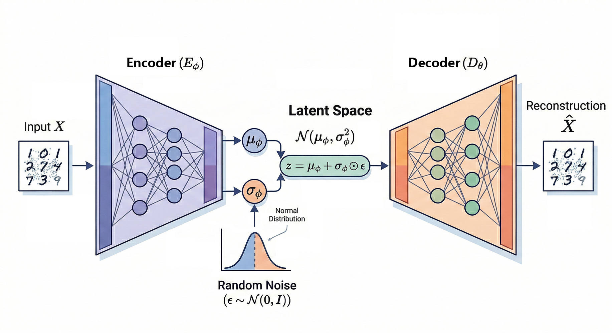

# 🎵 ℂ-VAE: end-to-end Complex-Valued Variational Autoencoder for Audio


<p align="center">
  
</p>

> [!IMPORTANT]
> 🚧 **This project is under active development as part of my Master's Thesis.** Feel free to star ⭐️ the repo to stay updated!

---

## 📋 Objective

This repository explores **complex-valued Variational Autoencoders (VAEs)** for high-fidelity music reconstruction. The core hypothesis is that operating directly on complex-valued spectrograms, with and end-to-end complex architecture, yields higher reconstruction quality and better latent space properties.

The codebase provides:

- **`ar_spectra:`** A modular library of encoder/decoder architectures based on complex-valued neural network building blocks, with training infrastructure (PyTorch Lightning) and loss functions (spectral, perceptual, adversarial). Developed by [Luca Cerovaz](https://github.com/CerovazS) and refactored by me.

- **`c-vae:`** 🚧 A module for the complex-valued VAE generative model (not yet implemented).

Training is fully configured via [Hydra](https://hydra.cc/) YAML files, logged through [Weights & Biases](https://wandb.ai/), and evaluated with standard audio quality metrics (SI-SDR, spectral convergence, CDPAM, FAD).

---

## 📁 Project Structure

```bash
C-VAE/
├── config.py                             # Centralized constants: paths, sample rate, device, seeds
├── train.py                              # Hydra training entrypoint (PyTorch Lightning)
├── evaluate.py                           # Inference script
├── dataloader.py                         # OnTheFlySTFTDataset that loads audio, computes STFT on-the-fly
├── test_eulero_inference.py              # Quick smoke test for EuleroDec inference
├── pyproject.toml                        # Package metadata, dependencies, build config (hatchling)
├── .gitignore
│
├── config/                               # Hydra YAML configuration hierarchy
│   ├── main.yaml                         # Top-level composition: selects model, data, trainer groups
│   ├── data.yaml                         # Dataset & dataloader config (STFT params, splits, channels)
│   ├── trainer.yaml                      # Optimizer, scheduler, losses, WandB, training hyperparams
│   └── models/                           # Model architecture configs (one per architecture)
│       ├── SEANet_real_model.yaml         # Real-valued SEANet encoder/decoder (ELU, weight_norm)
│       ├── SEANet_cplx_model.yaml         # Complex-valued SEANet (CReLU, is_complex: true)
│       ├── hf_autoencoder_kl.yaml         # HuggingFace AutoencoderKL (diffusers)
│       ├── hf_autoencoder_dc.yaml         # HuggingFace AutoencoderDC (DCAE, pixel_unshuffle)
│       └── simple_transformer_AE.yaml     # Complex-valued Transformer AE with patch embeddings
│
├── tests/                                # Evaluation metric scripts
│   ├── compute_all.py                    # Orchestrator — runs inference + all metrics end-to-end
│   ├── compute_all.sh                    # Bash equivalent of compute_all.py with virtualenv support
│   ├── compute_spectral.py               # SI-SDR + multi-resolution STFT loss (per-file CSV output)
│   ├── compute_cdpam.py                  # Contrastive Deep Perceptual Audio Metric (CDPAM)
│   └── compute_fad.py                    # Fréchet Audio Distance via VGGish embeddings
│
├── checkpoints/                          # Trained model checkpoints (.ckpt files)
├──  runs/                                 # Training run outputs (logs, profiler, TensorBoard)
│
│
└── src/
    ├── ar_spectra/                       # Core complex framework
    │   ├── models/                       # Model architectures
    │   │   ├── autoencoder.py            # AutoEncoder container: wires encoder + decoder + bottleneck
    │   │   ├── bottlenecks.py            # VAEBottleneck (KL reparametrization), SkipBottleneck (passthrough)
    │   │   ├── inference.py              # Standalone inference wrapper for checkpoints
    │   │   ├── implementations/          # Concrete encoder/decoder implementations
    │   │   │   ├── abstract_ae.py        # AbstractAutoEncoder base class (interface contract)
    │   │   │   ├── SeaNET_AE.py          # SEANetEncoder2d / SEANetDecoder2d (real & complex)
    │   │   │   ├── autoencoder_kl.py     # HFAutoencoderKLEncoder / Decoder (diffusers wrapper)
    │   │   │   ├── autoencoder_dc.py     # HFAutoencoderDCEncoder / Decoder (DCAE wrapper)
    │   │   │   └── simple_transformer_AE.py  # SimpleTransformerEncoder / Decoder (patch + ViT)
    │   │   └── discriminators/           # GAN discriminator zoo
    │   │       ├── __init__.py           # EncodecDiscriminator, OobleckDiscriminator, DACGANLoss, etc.
    │   │       ├── encodec.py            # MS-STFT discriminator (DiscriminatorSTFT, MultiScaleSTFTDiscriminator)
    │   │       ├── oobleck.py            # MPD / MSD / MRD discriminators
    │   │       ├── dac.py                # Descript Audio Codec discriminator
    │   │       ├── bigvgan.py            # BigVGAN discriminator
    │   │       ├── multi.py              # MultiScale and MultiPeriod discriminators
    │   │       ├── subband.py            # Subband CQT discriminator
    │   │       └── types.py              # Shared discriminator type definitions
    │   │
    │   ├── training/                     # Training infrastructure (PyTorch Lightning)
    │   │   ├── __init__.py
    │   │   ├── engine.py                 # AutoencoderEngine: core training/validation step logic
    │   │   ├── autoencoders.py           # AutoencoderTrainingWrapper (LightningModule) + ValDemoCallback
    │   │   ├── loss_manager.py           # LossManager: orchestrates weighted multi-loss computation
    │   │   ├── schedulers.py             # InverseLR learning rate scheduler
    │   │   ├── losses/                   # Loss function implementations
    │   │   │   ├── base.py               # BaseLoss: abstract loss interface
    │   │   │   ├── spectral.py           # ComplexMSE, MultiResSpectralConvergence, MelSpectrogramLoss, etc.
    │   │   │   ├── signal.py             # STFTLoss, L1/MSE time-domain losses
    │   │   │   └── perceptual.py         # HubertLoss, PhaseCosineDistance
    │   │   ├── callbacks.py              # DatasetEpochSetter, ModelInfoLogger (PL callbacks)
    │   │   ├── initialization.py         # collate_stft and weight initialization utilities
    │   │   └── pre_transform.py          # Spectrogram normalization: power_norm, log_mag, none
    │   │
    │   ├── blocks/                       # Modular neural network building blocks
    │   │   ├── activations/              # Activation functions
    │   │   │   ├── snake.py              # Snake activation (periodic, for audio)
    │   │   │   ├── silu.py               # SiLU / Swish (real & complex variants)
    │   │   │   ├── gelu.py               # GELU (real & complex variants)
    │   │   │   ├── relu.py               # ReLU, CReLU (split complex activation)
    │   │   │   └── misc.py               # Miscellaneous activations
    │   │   ├── attention/                # Attention mechanisms
    │   │   │   ├── complex.py            # Complex-valued multi-head attention
    │   │   │   └── standard.py           # Standard real-valued attention
    │   │   ├── conv/                     # Convolution layers
    │   │   │   ├── variants.py           # Conv1d/2d variants (complex, real, transposed)
    │   │   │   ├── causal.py             # Causal convolutions (for autoregressive models)
    │   │   │   └── normed.py             # Weight-normalized convs
    │   │   ├── embeddings/               # Embedding layers
    │   │   │   ├── positional.py         # Sinusoidal and learnable positional embeddings
    │   │   │   └── complex.py            # Complex-valued patch embeddings
    │   │   ├── normalization/            # Normalization layers
    │   │   │   ├── real.py               # LayerNorm, GroupNorm, RMSNorm
    │   │   │   └── complex.py            # Complex-valued normalization layers
    │   │   ├── subsampling/              # Downsampling / upsampling ops
    │   │   │   ├── conv1d.py             # Strided conv1d downsampling
    │   │   │   ├── conv2d.py             # Strided conv2d downsampling
    │   │   │   └── helpers.py            # Padding and shape utilities
    │   │   ├── transformer.py            # Transformer blocks (encoder/decoder layers)
    │   │   ├── layers.py                 # Residual blocks, FeedForward, and generic layers
    │   │   ├── rnn.py                    # LSTM / GRU wrappers
    │   │   └── complex_patch_merging.py  # Complex-valued patch merging for hierarchical models
    │   │
    │   └── utils/                        # Utility modules
    │       ├── audio.py                  # Audio I/O, resampling, channel matching
    │       ├── audio_probe.py            # Probe audio files for sample rate, channels, duration
    │       ├── audio_validation.py       # Validate audio integrity (silence, clipping, corruption)
    │       ├── console.py                # Rich console logging + WandB/CometML log helpers
    │       ├── distributions.py          # Probability distributions for VAE sampling
    │       ├── file_scanning.py          # Recursive file discovery with extension filtering
    │       ├── run_config.py             # Distributed rank helpers, run-name builders, checkpoint dir
    │       ├── metadata/
    │       │   ├── fma.py                # FMA dataset metadata reader (track splits, genre labels)
    │       │   └── providers.py          # Generic metadata provider interface
    │       ├── model_factory.py          # Dynamic model instantiation from config dicts
    │       ├── model_info.py             # Extract and log model parameter counts and structure
    │       ├── regenerate_checkpoint.py  # Re-save checkpoints with updated model keys
    │       ├── reproducibility.py        # Seed management and deterministic flag configuration
    │       ├── scan_corrupt_audio.py     # Batch scan for corrupt/unreadable audio files
    │       ├── spectral.py               # STFT / iSTFT helpers, spectral feature computation
    │       ├── tensors.py                # Tensor shape utilities, complex ↔ real conversion
    │       └── aeiou.py                  # Audio-to-STFT pipeline and channel format helpers
    │
    └── c-vae/                            # 🚧 Complex-valued VAE generative model (WIP)
        └── .gitkeep

```

---

## ⚙️ Installation

### Prerequisites

- **Python** ≥ 3.10
- **[uv](https://docs.astral.sh/uv/)** (recommended) or `pip`
- **CUDA 12.6** (for GPU training on Linux) or **MPS** (macOS Apple Silicon)

### Setup

```bash
# Clone the repository
git clone https://github.com/francescobrigante/C-VAE.git
cd C-VAE

# Install with uv (recommended)
uv sync
```

> [!NOTE]
> On Linux, PyTorch is automatically sourced from the `cu126` wheel index. On macOS (`darwin`), the default PyPI wheels are used (MPS backend). The `deepspeed` and `nvitop` packages are Linux-only dependencies.

---

## 🔧 Configuration

All configuration is managed through [Hydra](https://hydra.cc/) with a hierarchical YAML structure. Global constants live in `config.py` and are referenced in YAML files via a custom resolver:

```yaml
# Example: config/data.yaml references config.py constants
sample_rate: ${config:DEFAULT_SAMPLE_RATE}    # resolves to 44100
device: ${config:DEFAULT_DEVICE}              # resolves to mps / cuda:0 / cpu
```

### Configuration Hierarchy

| File | Purpose |
|------|---------|
| `config.py` | Global constants: paths, sample rate (44100), device auto-detection, seed (94), audio extensions |
| `config/main.yaml` | Top-level Hydra composition: selects which model, data, and trainer configs to load |
| `config/data.yaml` | Dataset (OnTheFlySTFTDataset) and dataloader settings: STFT params, batch size, workers, channel mapping |
| `config/trainer.yaml` | Optimizer (AdamW), scheduler (InverseLR), loss config, WandB settings, training hyperparameters |
| `config/models/*.yaml` | One file per model architecture (see [Architecture Overview](#-architecture-overview)) |

### Selecting a Model

Edit `config/main.yaml` to switch the active model:

```yaml
defaults:
  - data@data
  - models: seanet_real_model      # ← change this line
  # - models: seanet_cplx_model
  # - models: hf_autoencoder_kl
  # - models: hf_autoencoder_dc
  # - models: simple_transformer_AE
  - trainer@trainer
  - _self_
```

Or override from the CLI:

```bash
uv run train.py models=hf_autoencoder_kl
```

### Channel Configuration

Channel settings in `config/data.yaml` must match the model config:

```yaml
# stereo=true, cac=true  → audio_channels=2, model_channels=4
# stereo=true, cac=false  → audio_channels=2, model_channels=2
# stereo=false, cac=true  → audio_channels=1, model_channels=2
# stereo=false, cac=false → audio_channels=1, model_channels=1
audio_channels: 2
model_channels: 4
```

> [!NOTE]
> The `input_size` (encoder) and `channels` (decoder) in each model YAML **must** match `data.model_channels`. Mismatches will cause shape errors at runtime.

### Pre-Transforms

Spectrogram normalization applied before the encoder and inverted after the decoder:

| Type | Description |
|------|-------------|
| `none` | Raw STFT (no normalization) |
| `log_mag` | Log-magnitude scaling |
| `power_norm` | Power-law compression with configurable α / β |

---

## 🚀 Usage

### Training

Training uses Hydra's `@hydra.main` entrypoint, all configuration is resolved from YAML files:

```bash
# Train with default config
uv run train.py

# Train with a specific model
uv run train.py models=hf_autoencoder_kl

# Override training hyperparameters
uv run train.py models=seanet_cplx_model \
  trainer.trainer.epochs=100 \
  data.train_dataloader.batch_size=4 \
  trainer.optimizer.lr=1e-4

# Enable Weights & Biases logging
uv run train.py trainer.wandb.use_wandb=true \
  trainer.wandb.name=my_experiment

# Use specific precision
uv run train.py trainer.trainer.precision=bf16-mixed
```

### Inference

Reconstruct audio through a trained checkpoint using `evaluate.py`:

```bash
uv run evaluate.py \
  --model-checkpoint checkpoints/eulerodec.ckpt \
  --target-dir /path/to/audio \
  --output-dir /path/to/reconstructions \
  --device cuda:0 \
  --max-files 100
```

| Argument | Default | Description |
|----------|---------|-------------|
| `--model-checkpoint` | `checkpoints/eulerodec.ckpt` | Path to the trained `.ckpt` file |
| `--target-dir` | `DATA_PATH` from `config.py` | Directory containing input audio files |
| `--output-dir` | *(required)* | Where to save reconstructed `.wav` files |
| `--device` | Auto-detected (mps/cuda/cpu) | Compute device |
| `--extensions` | `.wav,.flac,.mp3,.ogg,.m4a,.opus` | Comma-separated audio file extensions |
| `--max-files` | `0` (all) | Limit number of files to process |

### Full Evaluation Pipeline

Run inference + all metrics in a single command:

```bash
# Python orchestrator (cross-platform)
uv run tests/compute_all.py \
  --output-dir results/my_run \
  --checkpoint checkpoints/eulerodec.ckpt \
  --target-dir /path/to/reference/audio

# Bash script (with virtualenv support)
uv run tests/compute_all.sh \
  --output-dir results/my_run \
  --checkpoint checkpoints/eulerodec.ckpt \
  --target-dir /path/to/reference/audio \
  --main-env .venv \
  --metrics-env .venv_metrics
```

Both support `--skip-cdpam`, `--skip-fad`, `--max-files`, separate `--infer-device` / `--cdpam-device`, and `--csv-dir` for metric output.

---

## 📊 Experiment Tracking

### Weights & Biases

Enable W&B logging in `config/trainer.yaml`:

```yaml
wandb:
  project: C-VAE
  name: my_experiment_name
  use_wandb: true         # set to false for TensorBoard-only
```

When enabled, the training script logs:

| What | W&B Key |
|------|---------|
| Training losses (per step) | `train/loss_*` |
| Validation losses | `val/loss_*` |
| Audio reconstructions | `val/recon` |
| Mel spectrograms | `val/recon_melspec_left` |
| Latent space embeddings (3D PCA) | `val/embeddings_3dpca` |
| Latent space spectrogram | `val/embeddings_spec` |
| Learning rate schedule | `lr-AdamW` |
| Hydra config files | Uploaded as W&B artifact (`hydra-conf`) |
| Model structure | `model_info.json` |

### TensorBoard (Fallback)

When `use_wandb: false`, logs are written to `runs/lightning_logs/` and viewable with:

```bash
tensorboard --logdir runs/lightning_logs
```

---

## 🏗 Architecture Overview

The system follows a modular **Encoder → Bottleneck → Decoder** architecture. All components are interchangeable via Hydra configs.

### Encoder / Decoder Implementations

| Architecture | Config | Domain | Key Features |
|---|---|---|---|
| **SEANet (Real)** | `SEANet_real_model.yaml` | Real | 2D conv encoder/decoder, ELU activation, weight normalization, configurable dilation |
| **SEANet (Complex)** | `SEANet_cplx_model.yaml` | Complex | Same architecture with `is_complex: true`, CReLU activation, operates on complex-valued tensors |
| **AutoencoderKL** | `hf_autoencoder_kl.yaml` | Real | HuggingFace diffusers `AutoencoderKL`, UNet-style down/up blocks, mid-block attention |
| **AutoencoderDC** | `hf_autoencoder_dc.yaml` | Real | HuggingFace `AutoencoderDC` (DCAE), pixel-unshuffle downsampling, RMS normalization |
| **Transformer AE** | `simple_transformer_AE.yaml` | Complex | Vision Transformer style, patch embeddings, complex-valued attention and FFN |

### Bottleneck Types

| Bottleneck | Class | Description |
|---|---|---|
| **VAE** | `VAEBottleneck` | Reparametrization trick: μ/σ → z ~ N(μ, σ²), KL divergence regularization |
| **Skip** | `SkipBottleneck` | Passthrough: no compression or regularization (deterministic AE) |

### Discriminator Zoo

Available for adversarial training (configured via `loss_config` when GAN losses are enabled):

| Discriminator | Source |
|---|---|
| `EncodecDiscriminator` | Meta's Encodec |
| `OobleckDiscriminator` | MPD / MSD / MRD combination |
| `DACGANLoss` | Descript Audio Codec |
| `BigVGANDiscriminator` | BigVGAN multi-period |
| `MultiScaleDiscriminator` | Multi-scale waveform |
| `MultiPeriodDiscriminator` | Multi-period waveform |
| `SubbandCQTDiscriminator` | Subband Constant-Q Transform |

### Training Losses

| Category | Losses |
|---|---|
| **Spectral** | `ComplexMSE` (stft_mse), `MultiResSpectralConvergence`, `MultiResolutionSpectrogramLoss`, `MelSpectrogramLoss` |
| **Signal** | `STFTLoss`, L1, MSE (time-domain) |
| **Perceptual** | `HubertLoss` (HuBERT feature matching), `PhaseCosineDistance` |
| **Regularization** | KL divergence (from VAEBottleneck) |
| **Adversarial** | GAN generator + feature matching losses (from discriminators) |

Losses are orchestrated by `LossManager`, which applies per-loss weights defined in `trainer.yaml`:

```yaml
loss_config:
  spectral:
    stft_mse:
      config:
        reduction: mean
    weights: {stft_mse: 1.0}
  bottleneck:
    weights:
      kl: 1e-3
```

### Data Pipeline

1. **`OnTheFlySTFTDataset`** loads raw audio files from disk
2. Computes STFT on-the-fly (n_fft=2048, hop_length=512, stereo, complex-as-channels)
3. Optional **pre-transform** normalizes spectrograms (`power_norm`, `log_mag`, or `none`)
4. **`collate_stft`** handles batching with padding and masking
5. During validation, **`AutoencoderValDemoCallback`** reconstructs audio via iSTFT and logs spectrograms + waveforms

---

## 🚧 C-VAE Module

> [!NOTE]
> The `src/c-vae/` directory is a placeholder for the upcoming **Complex-Valued VAE** generative model.

---

## 🙏 Credits
Built on top of:

- [PyTorch](https://pytorch.org/) and [PyTorch Lightning](https://lightning.ai/)
- [Hydra](https://hydra.cc/) by Facebook Research
- [HuggingFace Diffusers](https://github.com/huggingface/diffusers) (AutoencoderKL, AutoencoderDC)
- [Meta Encodec](https://github.com/facebookresearch/encodec)
- [Descript Audio Codec](https://github.com/descriptinc/descript-audio-codec)
- [complextorch](https://github.com/josiahwsmith10/complextorch) / [complexpytorch](https://github.com/wavefrontshaping/complexpytorch)
- [fadtk](https://github.com/microsoft/fadtk) (Fréchet Audio Distance Toolkit)
- [CDPAM](https://github.com/pranaymanocha/PerceptualAudio) (Contrastive Deep Perceptual Audio Metric)
- [FMA Dataset](https://github.com/mdeff/fma) (Free Music Archive)
- [EuleroDec](https://arxiv.org/pdf/2601.17517) a complex-valued RVQ-VAE for Audio coding

---

## 📄 License

> [!WARNING]
> A license file has not yet been added to this repository. All rights are reserved until a license is specified.